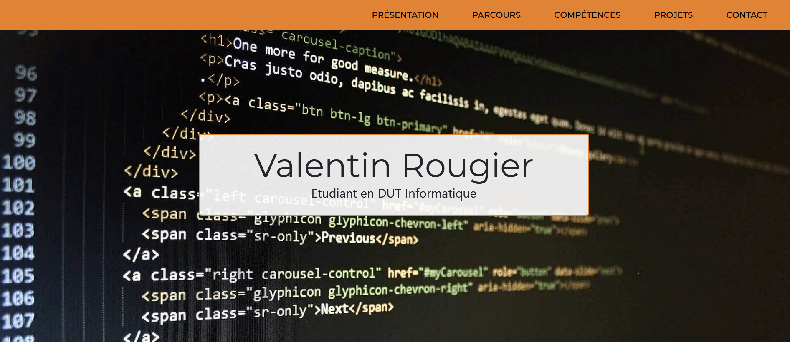
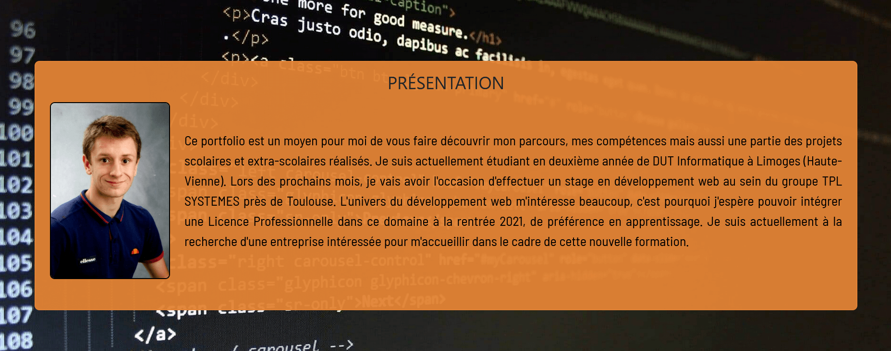
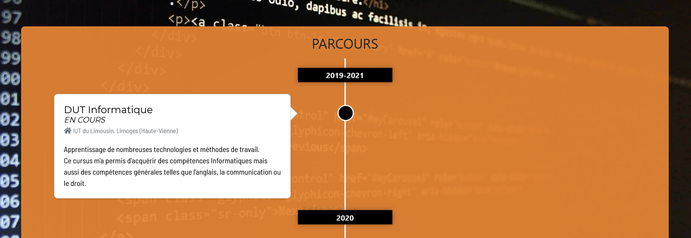
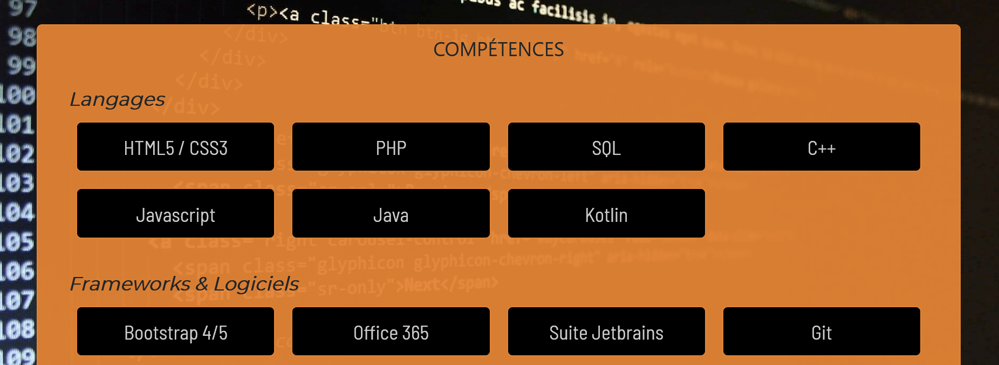
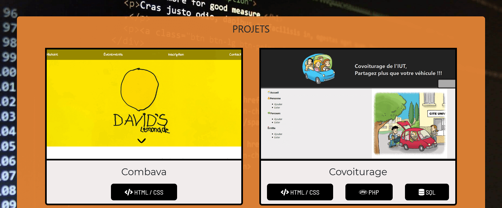
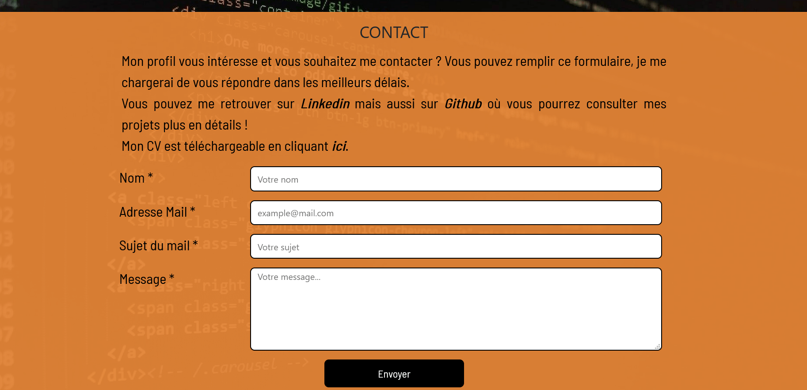

# Vitrine numérique
Mon portfolio est en ligne à l'adresse suivante [https://valentinrougier.fr](https://valentinrougier.fr). Sur cette adresse vous pourrez découvrir mon parcours, mes compétences ainsi qu'une bonne partie de mes projets réalisés durant mon cursus scolaire ou non. La réalisation du portfolio a été un bon exercice pour moi. Il m'a permis de mettre en pratique différentes technologies du Web telles que HTML/CSS ou jQuery dans un projet qui commence à être conséquent. 

## Présentation du projet
Le portfolio a été réalisé sous forme d'un one-page avec plusieurs parties : 
- Présentation
- Parcours
- Compétences
- Projets
- Contact

Un menu horizontal situé en haut de la fenêtre est disponible afin de naviguer plus facilement entre les parties.
Tout au long de la navigation, que cela soit sur mobile, tablette ou ordinateur, le fond d'écran est une image d'un éditeur de code HTML. Ce fond a été choisi car elle correspond bien avec le secteur du développement Web, secteur dans lequel je souhaite poursuivre mes études.
Lors de l'entrée sur le site, la partie "Présentation" est précédée de l'affichage de mon nom et prénom ainsi que de ma fonction actuelle qui est "étudiant".

Lorsqu'on fait défiler la page, les blocs s'affichent au fur et à mesure. Ces animations ont été réalisés grâce à la librairie AOS utilisant du Javascript.

### Présentation
Cette partie est la première du site, elle permet d'exposer sa personnalité à travers un texte descriptif. Une manière pour moi de dévoiler mes objectifs futurs.

### Parcours 
La partie "PARCOURS" a été conçue d'une façon à unifier deux parties distinctes : 
- Formation : côté gauche de la timeline
- Expériences (professionnelles, associatives...) : côté droit de la timeline

J'ai décidé de les unir sur une seule et même timeline car malgré que l'on oppose souvent la formation au monde professionnel, les deux s'unissent pour répondre au même objectif : Faire ce que l'on souhaite dans la vie et aimer ce que l'on fait. 

Opposer les couleurs des blocs était une solution pour faire comprendre à l'utilisateur que l'on parle de deux parties différentes.

### Compétences
La partie "COMPETENCE" a été dissocié en 3 parties : 
- Langages 
- Frameworks & logiciels
- Compétences générales
Les deux premières concernent des notions informatiques alors que la troisième est plus générale, elle traite les compétences utilisées tous les jours, pas uniquement dans le monde professionnel.

Lorsqu'on passe avec la souris sur l'une des compétences, mon niveau estimé est affiché en étoiles (/5). Je dois rappeler que le niveau affiché est uniquement une estimation en fonction des personnes que j'ai pu côtoyer, des facilités ou non que j'ai eu à réaliser certains projets... 

### Projets

Les projets sont une partie assez importante de ce portfolio. J'ai l'occasion de dévoiler les meilleurs projets que j'ai réalisé jusqu'à présent durant mon cursus informatique.
Chaque encart propose une photo représentant le projet ainsi que les technologies utilisées en dessous de celle-ci.
Lorsqu'on clique sur l'encart d'un projet un nouveau bloc apparaît en dessous. Ce nouveau bloc permet à l'utilisateur de découvrir plus en détails le projet, il aura accès a de nouvelles informations telles que description du projet ou encore le groupe de travail qui a réalisé celui-ci. Suivant les projets, il pourra aussi consulter le projet et/ou le dépôt Github.

### Contact
Pour la fin de ce one-page, on retrouve la traditionnelle partie "CONTACT".
En plus du formulaire, permettant à l'utilisateur de laisse un message s'il le souhaite, il trouvera aussi des liens directs pour mes réseaux sociaux : Linkedin et Github.

A la fin de cette partie, on retrouve la partie "obligatoire" d'un site, avec un lien vers les mentions légales.

## Outils et langages

### Projet développé en : 
- HTML/CSS
- PHP
- JQuery

### Avec : 
- PhpStorm
- Bootstrap 5
- Librairie AOS (Animate On Scroll)
- Adobe XD (maquettage)
